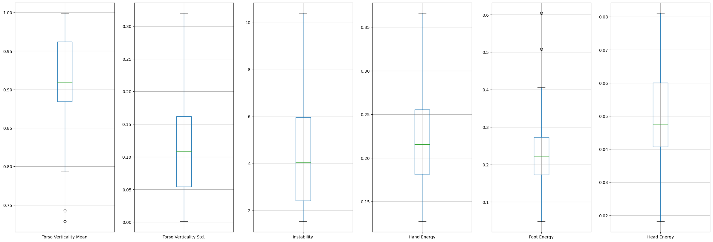

# Exploratory Data Analysis

## Feature Extraction

Because the data is numerically complicated, features are extracted first. Clustering and PCA are being considered, but for now features are manually created for ease of interpretability.

### Feature List

#### Torso Verticality

How vertical the torso is for a given frame. This is calculated by doing cosine similarity between a vector from the hip to the chest and a vector pointing straight up. 1 means the torso is vertical, 0 means horizontal, and -1 means upside down.

#### Kinetic Energy

The magnitude of the velocity for a joint within a given frame, calculated using the current and previous frame's positions. High velocity generally means high kinetic energy, though this name may need to be revised as mass is not a factor.

Kinetic energy is currently calculated for the hands, feet, and head.

#### Instability

The magnitude of the jerk (a.k.a. the derivative of acceleration) for a joint within a given frame, calculated using the previous 3 frames. High jerk generally means erratic motion.

Instability is currently calculated for the root (center of the hips).

## Small Data Insights

The following graphs are insights for the first 3 subjects.

### Correlation Matrix

|                        |   Torso Verticality Mean |   Torso Verticality Std. |   Instability |   Hand Energy |   Foot Energy |   Head Energy |
|:-----------------------|-------------------------:|-------------------------:|--------------:|--------------:|--------------:|--------------:|
| Torso Verticality Mean |                 1        |              -0.939461   |   -0.179308   |      0.190789 |      0.472004 |    -0.499854  |
| Torso Verticality Std. |                -0.939461 |               1          |    0.00694171 |     -0.172404 |     -0.566613 |     0.533551  |
| Instability            |                -0.179308 |               0.00694171 |    1          |     -0.232703 |      0.219031 |    -0.0486273 |
| Hand Energy            |                 0.190789 |              -0.172404   |   -0.232703   |      1        |      0.3542   |     0.275314  |
| Foot Energy            |                 0.472004 |              -0.566613   |    0.219031   |      0.3542   |      1        |    -0.343434  |
| Head Energy            |                -0.499854 |               0.533551   |   -0.0486273  |      0.275314 |     -0.343434 |     1         |

### Box Plots

