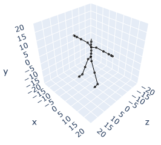
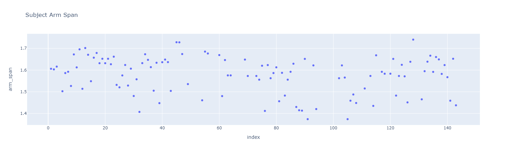
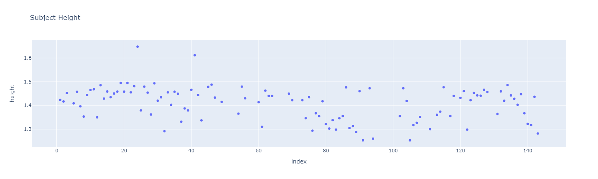
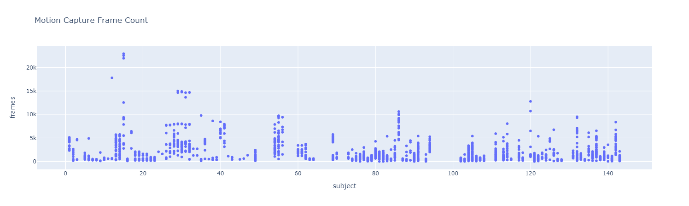
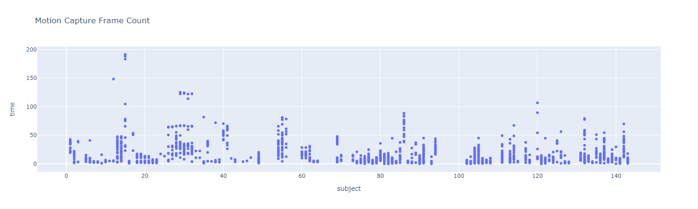

# Pose Estimation for a Virtual Reality HMD and Controllers

- **Author**: Shawn Oppermann
- **Term**: Summer 2023

## Premise

Virtual Reality (VR) gaming is rising in popularity as a pastime, but not without issue. The standard VR setup consists of a head-mounted display (HMD) and two controllers. This alone may be hard to afford, but adding full-body tracking can be prohibitively expensive, as each tracked joint requires a separate tracker.

VR uses body tracking to project the orientation of parts of a user's body into the virtual environment. With an HMD and controllers, 3-point tracking is possible, the three points being the head, left hand, and right hand. Popular VR games such as VRChat have users control a standard rig that includes joints for the hands, feet, elbows, knees, hips, chest, neck, shoulders, and head. This means that up to 11-point tracking is possible. Most users only have 3-point tracking, meaning the rest of the joint orientations are inferred. While inverse kinematics (IK) can make a fast, reasonable inference for individual limbs, the error between the true and inferred joint orientations across the entire rig can often be quite large.

VR software supports additional body trackers to reduce inference, but this approach can become cumbersome and unaffordable. To the end of avoiding additional hardware, the proposed project aims to explore the applications of various regression models (most likely with an emphasis on deep learning) for pose estimation, comparing the speed and accuracy of different approaches. In other words, the project should answer the question of whether it is feasible to predict the pose of an entire human body using only the location and orientation of a few joints, initially just the head and hands.

## Dataset

Carnegie Mellon University researchers have courteously provided an open source motion capture database. The data consists of the joint positions and orientations for various motion-captured actions. For example, there are entries for men and women running, playing sports, sitting, etc. for 30 or more frames. 

Information regarding the subjects, types of motion, and the dataset itself can be found at http://mocap.cs.cmu.edu/info.php. A reson I enjoy this dataset is because of its wide range of motion, ranging from just walking to full-blown acrobatics. The diversity is important for training a general model for pose estiation.

Each motion capture animation consists of the position and orientation of 31 different joints. The joints used for a standard VR rig are a subset of the joints used in the dataset. The position and bone length is in a custom scale, but can be converted to meters. The orientation is a rotation 3x3 matrix, with each of the elements ranging from 0 to 1.

Here is a the joint tree for each skeleton in the motion capture dataset:

```
└── root
    ├── lhipjoint
    │   └── lfemur
    │       └── ltibia
    │           └── lfoot
    │               └── ltoes
    ├── rhipjoint
    │   └── rfemur
    │       └── rtibia
    │           └── rfoot
    │               └── rtoes
    └── lowerback
        └── upperback
            └── thorax
                ├── lowerneck
                │   └── upperneck
                │       └── head
                ├── lclavicle
                │   └── lhumerus
                │       └── lradius
                │           └── lwrist
                │               ├── lthumb
                │               └── lhand
                │                   └── lfingers
                └── rclavicle
                    └── rhumerus
                        └── rradius
                            └── rwrist
                                ├── rthumb
                                └── rhand
                                    └── rfingers
```

And here is the subset of that joint tree relevant to VR full-body tracking:

```
└── root*
    ├── lfemur
    │   └── ltibia*
    │       └── lfoot*
    ├── rfemur
    │   └── rtibia*
    │       └── rfoot*
    └── lowerback
            └── thorax*
                ├── lowerneck
                │       └── head*
                ├── lclavicle
                │   └── lhumerus*
                │       └── lradius
                │           └── lwrist*
                │               ├── lthumb
                │               └── lhand*
                └── rclavicle
                    └── rhumerus*
                        └── rradius
                            └── rwrist*
                                ├── rthumb
                                └── rhand*
```
The joints with asterisks are the joints that would need to be tracked to determine the body's entire pose assuming all bone lengths are known.

To ensure that the positions and bonel lengths are in meters, CMU provides meter conversion scale of (1.0/0.45)*2.54/100.0

## Preliminary EDA

The data is split into 112 unique subjects, and there are 2514 unique motions in total, the motions being the actual animations themselves. 

### Arm Span and Height

The set of motions withing a given subject all use the same person, meaning the bone lengths and rest position of the skeleton are the same. For each subject, the arm span and the height of the subjects are measured.

* Arm span is the distance between the left and right hands at rest.
* Height is the distance between a foot and the head.

Note that the height is likely not the actual height of the subject, as the head tracker is not on top on the head and the legs are spread out to be diagonal, creating a sort of "star-pose". Theses values are mostly used to ensure that each rest pose is approximately the same. 

An example of a star-pose
is shown below. This is subject 1 in the dataset.



Below is the distribution of arm span and height (in meters) for subjects. The variance is very low, and suggests that most subjects have a reasonable rest pose. There are two high outliers in height, and it may be worth checking those subjects to see if their pose is different or if the subjects are just tall.




### Animation Length

It was found that motions can range from being ~2 seconds long to ~3 minutes long, do data cleaning may be necessary to ensure reasonable motions.

Below is the distributions of frame counts, grouped by subject. Another table with the axis converted to seconds has also been added.




## Process

This research aims to compare the speed and accuracy of inference using various deep learning techniques such as Convolutional Neural Networks (CNNs), Feed-Forward Neural Networks (DNNs), and Long-Short Term Memory Networks. Additional regression models may be tested, such as Random Forests, but this sort of inference should not require approaches more complicated than the ones already mentioned.

The training process will involve masking various joints and then training each model on the dataset, predicting the location of the masked joints. Joints taken into consideration may vary depending on what is tracked by hardware. For example, it is hard to justify inferring the orientation of the legs if there is no information provided about them.

Runtime will be measured by running inference on a test set and recording the total time elapsed. Accuracy will refer to the mean-squared error (MSE) of all inferred joints when compared to the true joint positions. It is important to find a solver that not only returns accurate results, but also has the ability to run in realtime.

As an example for the upper body:

* The input would be the head, left hand, and right hand location (meters) and rotation (3x3 rotational matrix)
* The outputs would be the location and rotation of the elbows, chest, and waist.
* So training would involve using the head, hands, elbows, chest and waist within the dataset. During training, we mask the elbows, chest and waist and run prediction. Loss is the mean square error between the predicted and actual joint locations. The same can be applied to rotations, and they may be weighted differently.

## Deployment

Deep Learning models in particular are easy to export into the .onnx format. This allows the model to be used in the game engine Unity via their extension Barracuda. From there live testing can be performed by using a VR headset and controllers by creating a small VR testing application. Alternatively, a Stremlit app can be created that uses plotly to demonstrate how closely the pose prediction matches a test set.

## References

**Dataset:** “Carnegie Mellon University - CMU Graphics Lab - Motion Capture Library.” CMU Graphics Lab Motion Capture Database, Carnegie Mellon University, http://mocap.cs.cmu.edu/. 
