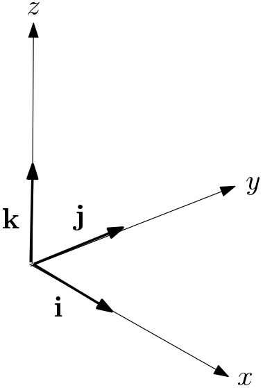

# Pose Estimation for a Virtual Reality HMD and Controllers

UMBC DATA 606 Capstone
Shawn Oppermann
Summer 2023

---

## Introduction

Virtual Reality (VR) gaming is rising in popularity as a pastime, but not without issue. The standard VR setup consists of a head-mounted display (HMD) and two controllers. This alone may be hard to afford, but adding full-body tracking can be prohibitively expensive, as each tracked joint requires a separate tracker.

  

---

## Proposal

Instead of buying additional trackers for each joint, use machine learning to predict the location of untracked joints.

---

## Dataset

### CMU Motion Capture Dataset

Carnegie Mellon University's open source motion capture database. 

Consists of the joint positions and orientations for various motion-captured actions.

http://mocap.cs.cmu.edu/info.php

---

## Dataset

### Specifics

144 subjects
- Each subject contains a set of motions
- Organizes motions by theme

2605 motions
- Each motion represents a type of action

As an example, motions can contain for men and women running, playing sports, sitting, etc. for 30 or more frames.

---

## Dataset

### Features

Each frame of motion has 31 joints. For each joint:
- Position vector $<p_x, p_y, p_z>$
- Rotation matrix $
    \begin{bmatrix}
    i_x & i_y & i_z & \\
    j_x & j_y & j_z & \\
    k_x & k_y & k_z   \\
    \end{bmatrix}
$

---

## Modeling

### Input Features

The positions and rotations of tracked joints

i.e. Hands, Hand -> 3 positions + 3 rotations -> 9 scalars + 27 scalars -> 36 scalars

### Target variable 

The positions of a selection of untracked joints.

i.e. Shoulders, Chest, Hips -> 4 positions -> 12 scalars

### Loss Function

Mean squared error between predicted and actual target variable scalars.

---

## Modeling

### Sampling

Dataset is stratified based on EDA / feature enrichment.

Stratified on: Torso Verticality Std., Instability

Selected 20 motions from each bin, then 90/10 train-test split on the motions

| Torso Verticality Std.      | Instability | Motions |
| --------------------------- | ----------- | ------- |
| Low                         | Low         | 104     |
| Low                         | Med         | 108     |
| Low                         | High        | 159     |
| Med                         | Low         | 135     |
| ...                         | ...         | ...     |

---

## Modeling

### Models

6 models trained.

2 configurations:
- Upperbody Inference: Head, Hands -> Hips, Chest, Shoulders
- Fullbody Inference: Head, Hands, Feet -> Hips, Chest, Shoulders, Thighs

3 models trained per configuration:
- Linear Regression
- Quadratic (Polynomial, degree = 2) Regression
- Random Forest Regression (100 estimators)

---

## Results

| Model Type | Config | MSELoss |
| ---------- | ------ | ---- |
| Linear     | Upperbody | 1.3162
| Quadratic  | Upperbody | 0.2135
| Random Forest | Upperbody | 0.0766
| Linear     | Lowerbody | 0.7161
| Quadratic  | Lowerbody | 0.0579
| Random Forest | Lowerbody | 0.0721

However, the loss does not necessary reflect the performance. This will be explained in the demo.