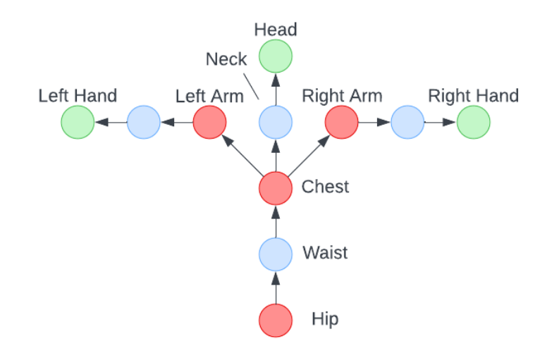

# Regression Modeling Upper Body Pose Estimation for Virtual Reality HMD and Controllers

_DATA606 Shawn Oppermann_

_UMBC Summer 2023_

## Presentation File

pptx: https://github.com/soppermann/shawn_data606/tree/main/docs/presentation.pptx

marp/markdown: https://github.com/soppermann/shawn_data606/tree/main/docs/presentation.md

## Original Dataset Link

http://mocap.cs.cmu.edu/

## Video Presentation

https://youtu.be/P3u8BLoyBP4

## Abstract

Virtual Reality (VR) gaming is rising in popularity as a pastime, but not without issue. The standard VR setup consists of a head-mounted display (HMD) and two controllers. This alone may be hard to afford, but adding full-body tracking can be prohibitively expensive, as each tracked joint requires a separate tracker. To the end of avoiding additional hardware, this paper proposes an application of regression models for pose estimation. This paper compares various basic regression modeling approaches with a particular focus on ways motion capture data can be prepared for training and post processed for inference.

## Introduction

Popular VR games such as VRChat have a standard rig that includes joints for the hands, feet, elbows, knees, hips, chest, neck, shoulders, and head. Most users only have three trackers for the hands and head, meaning the rest of the joint positions are inferred. While inverse kinematics (IK) can make a fast, reasonable inference for individual limbs, the error between the true and inferred joint positions across the entire rig can often be quite large.

VR software supports additional trackers to reduce inference, but this approach can become cumbersome and unaffordable. One of the most common full body tracking setups include 3 or 4 Vive Trackers 3.0 alongside an HMD, hand trackers, and Valve’s base stations, which will easily surpass $1000. Currently, there are effectively no ways to experience full body tracking without having to purchase the additional Vive Trackers. However, regression modeling has potential to be a viable alternative to hardware tracking due to the availability of general-case motion capture data. In particular, Carnegie Mellon University has publicly released motion capture data of various people performing a wide variety of tasks, including walking, dancing, and playing sports.

Additionally, regression modeling as an alternative is attractive because of its scalability of performance. In order for any pose estimation system to be usable, it needs to be able to predict the pose in real time. Given a model with few enough parameters, a linear model network can easily run in real time. This research aims to compare the speed and accuracy of inference using basic regression models as compared to FABRIK, the most popular inverse kinematic method to date.

## Related Work

### CCD

Wei Song and Guang Hu propose the Cyclic Coordinate Descent (CCD) algorithm, a heuristic iterative IK solver that quickly determines the necessary angles and joint orientations to reach a target, i.e., the way a limb must bend to reach a point in space[^1]. This was the first heuristic solver to gain a lot of traction as it avoids matrix jacobians, which can be expensive to compute.

[^1]: Song, Wei, and Guang Hu. “A Fast Inverse Kinematics Algorithm for Joint Animation.” Procedia Engineering, vol. 24, 2011, pp. 350–354., https://doi.org/10.1016/j.proeng.2011.11.2655. 

### FABRIK

Andreas Aristidou and Joan Lasenby propose Forward and Backward Inverse Kinematics (FABRIK), which proves to be a faster heuristic iterative solver thanks to avoiding the use of angular data in addition to jacobians[^2]. This is the most commonly used IK solving method to date.

[^2]: Aristidou, Andreas, and Joan Lasenby. “Fabrik: A Fast, Iterative Solver for the Inverse Kinematics Problem.” Graphical Models, vol. 73, no. 5, 2011, pp. 243–260., https://doi.org/10.1016/j.gmod.2011.05.003. 

### Deep Learning Upper Body Pose Estimation

Taravat Anvari, Kyoungju Park, and Ganghyun Kim explore the applications of deep learning for upper body pose estimation through the use of Convolutional Neural Networks (CNNs) and Dense Neural Networks (DNNs) given the head and hand joint locations[^3]. The CNN regression model showed improvements in both accuracy and runtime when compared to FINAL IK, a package that uses the FABRIK solver[^4].

[^3]: Anvari, Taravat, et al. “Upper Body Pose Estimation Using Deep Learning for a Virtual Reality Avatar.” Applied Sciences, vol. 13, no. 4, Feb. 2023, p. 2460. Crossref, https://doi.org/10.3390/app13042460.

[^4]: RootMotion. http://root-motion.com (accessed on 27 January 2023).

## Dataset

### Overview

Carnegie Mellon University researchers have courteously provided an open source motion capture database[^5]. The data consists of the joint positions for various motion-captured actions. For example, there are entries for men and women running, playing sports, sitting, etc. for usually 1000 or more frames. The motion data is captured in 120 Hz, meaning 120 frames of data make up one second of real-time motion. The joints for a standard VR rig are a subset of the joints used in the dataset. Yuxia Zhou has also provided a convenient AMCParser for importing ASF/AMC files from the dataset into python[^6], though a different parser has been created for this workflow in order to more easily express joint data.

[^5]: "Carnegie Mellon University - CMU Graphics Lab - Motion Capture Library." CMU Graphics Lab Motion Capture Database, Carnegie Mellon University, http://mocap.cs.cmu.edu/. 

[^6]: Zhou, Yuxiao. “AMCParser.” GitHub, Microsoft, 2018, https://github.com/CalciferZh/AMCParser. 

### Details

The CMU Graphics Lab Motion Capture Database consists of 113 different subjects, each labeled on their website. Each subject represents a different type of activity, which can include running, walking, communicating, dancing, and so on. Each subject contains a number of trials performing similar actions, though some subjects have more diverse trials than others. For example, subject #2 is labeled “various expression and human behaviors”, and contains swordplay, walking, and punching, while subject #3 is labeled “walk on uneven terrain”, and contains exactly that. For training, sampling is stratified over the subjects at 10000 unique frames per subject. This allows for the pose estimation model to more easily adapt to a wider variety of actions.

The joints used in typical full body tracking is a subset of the rig used in the motion capture database.

Markers in green are input trackers, while markers in red are trackers that need to be predicted. All blue joints can mostly be inferred from the seven joints in red and green.

For each subject, the pose is expressed through bones, which have parent bones, orientations, and lengths. It’s important to note that animations, with the exception of the root of the rig, are really only expressed in terms of rotating these bones, which implies that pose prediction can also be expressed in terms of joint rotations alone. However, as the input for prediction consists of hand and head tracker position and rotation, it makes more sense to predict both the position and rotation of missing trackers to emulate the use of additional trackers.

## EDA

## Pose Regression

The motion capture data must be parsed, posed, and normalized before sampling and training can occur. Additionally, after inference, the prediction must be converted into data that can be used in a virtual environment.

### Data Preparation

The hierarchy of the data can be described in the order subject > trial > frame > joint > (position, rotation). Within each subject of the dataset is a set of trials (trials are sometimes referred to as motions within the project files). Each trial is an animation consisting of a series of frames, with each joint expressed through a rotation relative to its parent. Through recursive transforms starting from the root and going outward, it is possible to recreate the entire pose through bone rotations from the rest pose alone. In order to more easily train a model on the data, this pose data was translated into the global position and rotation for each joint. The positions are supposed scaled by a factor of (1.0/0.45) * (2.54/100.0) as recommended by CMU to express positions in meters (0.45 is an arbitrary AMC scale, and 2.54/100 is conversion from inches to meters). However, scaling has not been applied as it can be applied after modeling with the same results.

The global position is represented by a 3-dimensional vector, while the global rotation is represented by a 3x3 rotational matrix. While it is common to express rotation in terms of euler angles or quaternions, these representations are not continuous in the same way rotational matrices are, as euler angle parameters x, y, and z are bound by the range [0, 2π] while quaternion parameters x, y, and z are bound by the range [-1, 1]. One could make an argument that euler angles and quaternions can actually range all real numbers, but this can cause gradients to explode during training, since the same target value exists infinite times across the set of all real numbers. Expressing rotations in terms of euclidean space guarantees continuity and uniqueness.

Normalization can be an important part of ensuring that training on the data is effective. While it was not used in the training for the current iteration of the project, it’s important to note that for poses, this can also be done. For training, normalization involves switching from global space to local space relative to the head tracker. This means each joint position is expressed as the distance from the head tracker, and the rotation is expressed as the delta rotation between the head tracker rotation and the joint rotation. However, applying this to the head tracker itself causes the position to be (0, 0, 0) and the rotation to be the identity matrix regardless of the pose. To ensure that the head tracker data is still useful for training, its global position and rotation should be preserved in normalization. This also means that the model still receives information regarding where the rig is in global space.

Before training begins, each subject is prepared such that each joint for each frame has a position vector and rotation matrix. Enrichment is also performed, adding the velocity and acceleration of each joint based on the position of the previous two frames.

| trial | frame | joint | position | rotation | velocity | acceleration |
|-------|-------|-------|----------|----------|----------|--------------|
| 1     | 0     | head  | [...]    | [[...]]  | [...]    | [...]        |
| ...   | ...   | ...   | ...      | ...      | ...      | ...          |

An example of what the data for a subject might look like in pandas dataframe form.

### Sample Stratification

In a previous iteration of the project, it was noted that models that predicted the upperbody’s pose struggled with correctly predicting poses where the torso was not horizontal. To mitigate this error in the current iteration, the dataset is sampled based on certain features engineered in the EDA phase. In particular, the sampling is stratified based on the standard deviation of the torso verticality for a given trial and the instability for a given trial. The reason these two features were chosen over the others is because of their low correlation with each other, meaning that these features were likely independent of each other and bore significance on their own. 

Torso verticality is the primary focus since a higher standard deviation in torso verticality likely meant that the trail had many instances where the torso was not vertical, and more exposure to this type of data has the potential to mitigate the inaccurate torso verticality overfitting that was prevalent previously.

The number of trials/motions that fell under each bin is listed in the table below. For this project 20 motions from each bin were randomly selected, then a 90/10 train-test split on the motions was performed.

| Torso Verticality Std.      | Instability | Motions |
| --------------------------- | ----------- | ------- |
| Low                         | Low         | 104     |
| Low                         | Med         | 108     |
| Low                         | High        | 159     |
| Med                         | Low         | 135     |
| Med                         | Med         | 131     |
| Med                         | High        | 104     |
| High                        | Low         | 132     |
| High                        | Med         | 131     |
| High                        | High        | 107     |

### Training

The training process involves masking various joints and then training each model on the dataset, predicting the location of the masked joints. Joints taken into consideration may vary depending on what is tracked by hardware. For example, it is hard to justify inferring the orientation of the legs if there is no information provided about them. As this paper is focused on upper body pose estimation, the models predict the orientation of the hips, chest, and upper arms based on the orientation of the head and hands. In other words, three tracked joints are used to recreate a pose made from seven joints from the waist up. However, training has also been run using both the lower body in addition to the upperbody. In other words, the position and orientation of the feet are unmasked and are used to predict the hips, chest, and upper arms as well.

For performance and simplicity reasons, only Linear, Quadratic (polynomial regression with degree = 2), and Random Forest Regression were considered for training. There are two versions of each regression model, one predicting the upperbody pose, and one predicting the upper and lower body pose.

There are multiple ways to create a loss function for prediction, but it depends heavily on the nature of prediction. For example, if we want to predict the rotation matrix of the masked joints in addition to the position, we add 9 scalar predictions per joint in addition to the 3 for position. To weigh rotation and position accuracy equally using a loss function such as mean squared error, the MSE loss of position and rotation may be calculated separately, and the losses can be weighed differently and added together. Once again, the project has been simplified to that only the position of masked joints is considered in prediction. This makes it so it’s much easier to use MES loss without worrying about weighing different types of data.

## Results

### Quantitative

The table below displays loss on the test set:

| Model Type    | Config    | MSELoss |
| ------------- | --------- | ------- |
| Linear        | Upperbody | 1.3162  |
| Quadratic     | Upperbody | 0.2135  |
| Random Forest | Upperbody | 0.0766  |
| Linear        | Fullbody | 0.7161  |
| Quadratic     | Fullbody | 0.0579  |
| Random Forest | Fullbody | 0.0721  |

According to the MSELoss of each model, one would think this Random Forest models are the most effective. Perplexingly, the quantitative results are opposite to the results shown when looks at the predictions themselves visually. However, it was generally the case that adding foot trackers (fullbody) improved results. This makes sense since it is hard to locate the hip without knowing anything about the legs.

### Qualitative

Individual model performance is easier to observe by looking directly at the prediction visualization rather than measuring the MSE loss function. This may indicate that the problem calls for a more sophisticated loss function. The visualization indicates that in actuality, the linear models had the most stable and accurate results in most cases, and the random forest models had a tendency to be the opposite. On occasion, the random forest models could produce wildly inaccurate results, and predictions between frames had plenty of jitter.

The following, however, generally applies to every model: Looking at animations of the motion capture overlaid with upper body tracker predictions, it becomes clear that the hip still accrues the most error. Particularly when bending over or leaning to the side, the torso’s orientation likes to remain vertical. In the figure below, a prediction using the linear model for the upperbody can be seen where the predicted torso is more vertical than the actual torso.

## Conclusion

There is a likely case for even just linear models being favorable in real time scenarios, especially in the virtual world both because the data provided and given are relatively simple and small. In future work, it may be work exploring the possibility that velocity and acceleration provide the information necessary to predict the next location without overcomplicating the model.

In future work, it would be useful to formulate a way to reconstruct the entire upper body using the output of the model. Rotation was underutilized in this experiment, but is instrumental in completing the pose. Alternatively, at the sacrifice of being able to emulate similar hardware, more trackers but without rotational data could be used to predict the pose of the upper body. While it may certainly still be possible to use regression modeling to reduce a lot of the required hardware for VR full body tracking, regression modeling has proven to be a viable tool to at least partially track the body.
